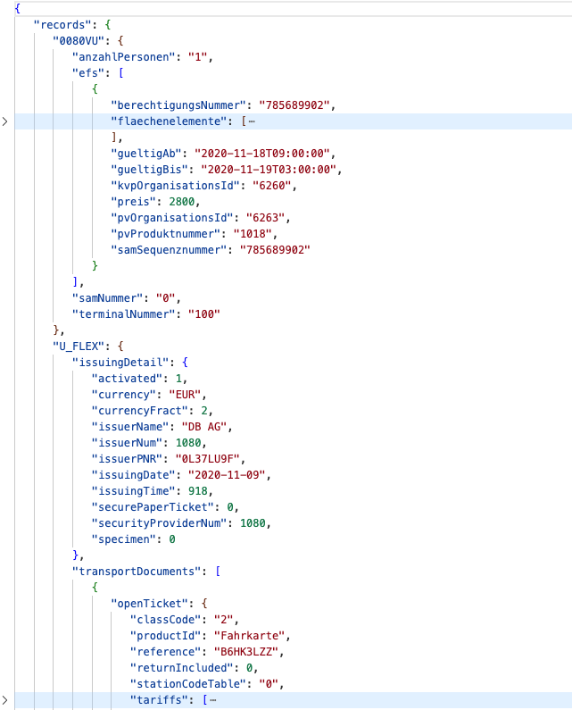
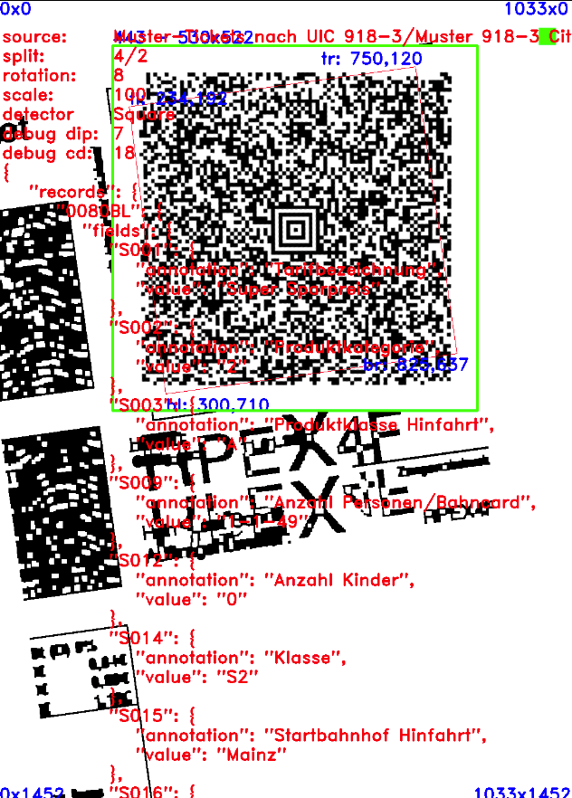

[](https://github.com/user4223/ticket-decoder/actions/workflows/arm64-macos.yml)
[](https://github.com/user4223/ticket-decoder/actions/workflows/x64-macos.yml)
[](https://github.com/user4223/ticket-decoder/actions/workflows/ubuntu24-clang16.yml)
[](https://github.com/user4223/ticket-decoder/actions/workflows/ubuntu24-gcc13.yml)
[](https://github.com/user4223/ticket-decoder/actions/workflows/ubuntu22-gcc11.yml)

# Overview

Provide optimized and robust methods to detect and decode aztec-codes by using opencv and zxing-cpp in combination and to transcode UIC918 information with **signature validation** into json structure. (UIC918-3 and UIC918-9)<br>

**Looking for build instructions? Take a look at the end of this document!**

## ticket-decoder

A command line tool to detect and decode uic918 content from aztec-codes from given input images/pdfs or raw data, verifies content and prints json result on stdout or dumps it into file.

Check `ticket-decoder --help` for arguments.


<p>

## ticket_decoder (Python module)

Provided python API is in an early state and the class DecoderFacade supports 2 methods right now only.
* `decode_uic918('...')` is considered for the use case you decode the raw data from aztec-code
  in advance via zxing or other aztec-code-decoder of your choice and you want to decode
  raw UIC918 data to json only.
  In this case, be careful with the output of the decoder to avoid string encodings like UTF8
  or other multi-byte encodings. Ideally try to get access to the raw byte array and just
  encode those bytes to base64 before passing it to the method.
  If your aztec-code-decoder provides a string-type only and you are able to pass
  character-encoding, try using 'ISO 8859-1' and cast the result string to raw bytes.
* `decode_files('...')` detects and decodes aztec-codes from file or directories (pdf, image) and decodes UIC918 data to json. This is using zxing-cpp internally. It returns an array of
  tuples (input-path and json-result) of size x, while x is the amount of aztec-codes found on input.

To build the module, some tools and dependencies are required. Beside python3 and essential build tools, it
is required to have python3-dev installed. On vanilla Ubuntu, the following steps should be enough to get it built.
```
apt-get update
DEBIAN_FRONTEND=noninteractive apt-get install --no-install-recommends -y build-essential git cmake python3-pip python3-dev python-is-python3 python3-venv
apt-get clean

python3 -m venv venv && . venv/bin/activate
pip3 install "conan" "numpy"

git clone https://github.com/user4223/ticket-decoder.git && cd ticket-decoder

./setup.Python.sh
```
Ensure PYTHONPATH is defined to enable Python to discover the ticket_decoder module. Try executing the test-cases.
```
export PYTHONPATH=`pwd`/build/Release/bin

python3 -m unittest discover -s source/test/python/
```
When the module has been build successfully, a Python script as shown below should work.
See `source/python/run.py` or `source/test/python/test_decode_uic918.py` for more detailed examples.
```
from ticket_decoder import DecoderFacade

decoder_facade = DecoderFacade(fail_on_interpreter_error = False)
for result in decoder_facade.decode_files('path/2/your/ticket.pdf'):
   print(result[1])
```

## ticket-analyzer

Analyzer has a minimal UI and is able to scan for aztec-codes in images grabbed from camera or from images/pdfs in a folder. It provides a simple interactive mode to visualize detection, image processing and decoding steps and to change some parameters to find optimal setup for detection. This application is considered to optimize default parameters and algorithms for the decoder.

Check `ticket-analyzer --help` for arguments.


<p>

To get a minimal setup for experimentation, do the following:
* Download UIC918-3 and UIC918-9 sample tickets from https://www.bahn.de/angebot/regio/barcode and extract zip files into folder ./images/
* Download XML file containing public keys of issuers from https://railpublickey.uic.org/ into folder ./cert/ and name it UIC_PublicKeys.xml
* Run `./build/Release/bin/ticket-analyzer` from workspace folder or use arguments to specify different paths to input files and folders
* Use following keys to tweak settings:
  * f: Next image input file from image-folder
  * F: Previous image input file from image-folder
  *  : Toggle and unpause camera device (space)
  * r: Rotate image -1 degree
  * R: Rotate image +1 degree
  * 2: Split image into 2 parts and rotate over parts
  * 4: Split image into 4 parts and rotate over parts
  * s: Scale image up
  * S: Scale image down
  * f: Flip image (x, y, x+y)
  * 0: Reset: Rotation, Scale, Split, Flip
  * d: Rotate over available detector implementations (forward, naive dip square detector, classifier)
  * p: Assume pure barcode (just forwarded to zxing-cpp)
  * b: Use local average binarizer (just forwarded to zxing-cpp)
  * h: Try harder (just forwarded to zxing-cpp)
  * D: Dump results into output-folder (0 disabled, 1 json, 2 json and raw data and images)
  * g: Increase gaussian kernal for smoothing (depends on detector)
  * i: Visualize next image processing step
  * I: Visualize previous image processing step
  * c: Visualize next contour detection step
  * C: Visualize previous contour detection step
  * o: Overlay detected barcode image (depends on detector)
  * t: Overlay decoded content or text (depends on detector)
* Check output-folder (./out by default) for intermediate images, raw data files or decoded data in json files


# Concepts and Ideas

## Design Goals

* Well separated dependencies to keep it maintainable and flexible for upcoming and deprecated libraries
  * The opencv core is an exception here since cv::Mat and other basic classes are used at all places
* Simple environment to evaluate changes in dip chain or decoder implementations from image files, binary data as well as from camera

## Modules

* **I/O:**\
Load and store for image and raw data from and to files and directories as well as read from camera device using opencv imageproc and highgui (includes PDF decoding via poppler library)
* **Detection (DIP):**\
Specialized [object detectors](source/lib/dip/detection/api/include/Detector.h) for barcode shapes, see section below for details
* **Decoding:**\
[Decoders](source/lib/barcode/api/include/Decoder.h) to get raw byte-arrays from aztec-codes (an implementation using zxing-cpp is the only one right now, but this works really good)
* **Interpretation:**\
[Interpreters](source/lib/uic918/api/include/Interpreter.h) to transcode different formats and records to json as well as verfication when possible (using interpreter pattern to separate the number of various, hierarchical structured formats)
* **UI:**\
Optional and minimal user interaction methods to support fast interactive experimentation with parameters for detection and decoding using opencv highgui (used by ticket-analyzer only)

## Detector implementations

* **Forward Detector:**\
[ForwardDetector](source/lib/dip/detection/api/include/ForwardDetector.h) simply passes the entire image from pre-processor to aztec-code decoder without additional modification
* **(Naive) DIP Square Detector:**\
[SquareDetector](source/lib/dip/detection/api/include/SquareDetector.h) tries to detect squares by using classic image processing like smoothing, binarizing, mophological operations, convex hull, edge detection and stuff and forwards only unwarped square image parts to aztec-code decoder
* **Classifier Detector:**\
[ClassifierDetector](source/lib/dip/detection/api/include/ClassifierDetector.h) is prepared to use the opencv classifier to detect aztec-code objects, but there is no properly trained classifier input file right now (frontal face detection example from opencv is used as an example and for verification only)


# Record Documentation

## U_HEAD / U_TLAY / U_FLEX

* Recommendation on TAP TSI Revision - Technical Document - B12<br>
  https://www.era.europa.eu/system/files/2022-10/Recommendation%20on%20TAP%20TSI%20Revision%20-%20Technical%20Document%20-%20B12.pdf <br>
  (Link not working anymore? Go to https://www.era.europa.eu/ and search for "TAP TSI Revision - Technical Document - B12")<br>
  (TAP: Telematics Applications for Passenger Service)<br>
  (TSI: Technical Specifications for Interoperability)<br>
  
### Code generation for U_FLEX ASN.1 UPER

* UIC-barcode
  https://github.com/UnionInternationalCheminsdeFer/UIC-barcode (Apache License 2.0)
* Install free open source ANS.1 compiler (BSD 2)<br>
  https://github.com/vlm/asn1c<br>
  * MacOS: `brew install asn1c`
  * Ubuntu: `apt install -y asn1c`
* Generate required code by using the following support script:
```
# Clones the repository and calls asn1c with matching parameters at the right places
#
./etc/setup.uic-asn1.sh
```

## 0080VU

* Interoperabilität Barcode DB Online-Ticket<br>
  https://assets.static-bahn.de/dam/jcr:8fa0c0b5-d7b8-443b-b3cd-7ae902884847/236539-315207.pdf

## 0080BL

* Parser für Onlinetickets der Deutschen Bahn<br>
  https://github.com/rumpeltux/onlineticket (GPL 3.0)
* uic-918-3<br>
  https://github.com/justusjonas74/uic-918-3 (MIT)


# Signature Checking / Id-Mapping

* Public keys from UIC<br>
  https://railpublickey.uic.org/

* List of numeric codes for railway companies (RICS Code)<br>
  https://uic.org/support-activities/it/rics

* DB Railway Station Documentation (EVA-Nummern)<br>
  https://data.deutschebahn.com/dataset/data-haltestellen.html


# Further Documentation and Ticket Samples

* Interoperability UIC/VDV codes, UIC918-3 and UIC918-9 example tickets and mappings for ids used in VDV codes<br>
  https://www.bahn.de/angebot/regio/barcode
  * [UIC918-3 Muster](https://assets.static-bahn.de/dam/jcr:c362849f-210d-4dbe-bb18-34141b5ba274/mdb_320951_muster-tickets_nach_uic_918-3_2.zip)
  * [UIC918-9 Muster](https://assets.static-bahn.de/dam/jcr:3c7a020a-7632-4f23-8716-6ebfc9f93ccb/Muster%20918-9.zip)
  ```
  # You can use the following command to convert PDF file into images for further processing, but you don't have to because application is able to precess pdf files directly. But decoding quality might differ depending on parameters like DPI.
  # brew|apt install imagemagick
  convert -density 250 -trim -quality 100 -flatten <file name>.pdf <file name>.png
  ```

* DB-AGs OLT Barcode to VDV Data Structure Reference Implementation<br>
  https://sourceforge.net/projects/dbuic2vdvbc/

* HandyTicket-Fahrausweise des VRR im VDV-Barcode<br>
  https://www.kcd-nrw.de/fileadmin/03_KC_Seiten/KCD/Downloads/Technische_Dokumente/Archiv/2010_02_12_kompendiumvrrfa2dvdv_1_4.pdf

* Additive Datenübertragung in Barcodes von internationalen Bahntickets<br>
  https://monami.hs-mittweida.de/frontdoor/deliver/index/docId/4983/file/WaitzRoman_Diplomarbeit.pdf

* KDE Barcode Formats - Ticket Barcode Formats<br>
  https://community.kde.org/KDE_PIM/KItinerary/Barcode_Formats
  Some details and collection of links related to different european rail companies and their ticket formats.

## Considerations about optical Resolution

* Printed code size: 48mm (1.89inch)
* With 200dpi:       1.89 inch/code * 200 dot/inch ~ 380 dot/code
* With UIC-918-3:    380  dot       / 87 blocks    ~ 4.37 dot/block


# Build Instructions

## Requirements

* gcc >= 11, clang >= 16 (other compilers and versions may work but are not tested)
* conan package manager >= 2 (https://conan.io/)
* cmake >= 3.19

* python3 numpy (boost.python requires numpy for build and unfortunately, it is not possible to disable it via conan config)

It is possible to build ticket-decoder and/or python module only and **to avoid the massive dependencies coming in via highgui stuff** for ticket-analyzer when it is not required. To do so, please pass `-o with_analyzer=False` to conan install and build the targets ticket-decoder and/or ticket_decoder via cmake only. Check [setup.Python.sh](setup.Python.sh) as a guideline.

Following libraries are used by the project. Usually you should not care about it since conan will do that for you.

* opencv        (image processing, image i/o and optional minimal UI)
* zxing-cpp     (barcode/aztec-code decoding)
* nlohmann_json (json support - output)
* easyloggingpp (logging)
* pugixml       (xml support - public key file)
* botan         (signature verification)
* tclap         (cli argument processing)
* gtest         (unit testing)
* poppler       (pdf reading/rendering)
  * is built via conan but with own recipe to get minimal and up-to-date version: see etc/poppler/conanfile.py
  * library create is integrated in etc/conan-install.sh script which is called from setup.Release.sh
* boost.python  (python binding)

## Ubuntu 22/24

### Inside docker build container

In general, when you want to avoid to install additional dependencies like non-default compilers and libraries on your system, consider using one of the build scripts using a docker container to create the build environment.<br>
As long as the conanfile.py is unchanged, you can re-use the container with pre-built dependencies, source code changes are directly mirrored into build environment and artifacts are mirrored back into host system. In case dependencies change, the container gets re-build with updated dependencies.

**This will install dependencies and run the build inside a ubuntu docker container**

* [setup.docker.ubuntu22.gcc11.sh](setup.docker.ubuntu22.gcc11.sh)
* [setup.docker.ubuntu24.gcc13.sh](setup.docker.ubuntu24.gcc13.sh)
* [setup.docker.ubuntu24.clang16.sh](setup.docker.ubuntu24.clang16.sh)
* [setup.docker.ubuntu22.gcc11.Python.sh](setup.docker.ubuntu22.gcc11.Python.sh)

When the preparation of the build environment has been successful, it should be possible to build the project by using `./build.sh -j` **inside the build container**.

Take a look into `./build/` folder to discover artifacts. You should be able to execute the executables on host machine as well.

### On host machine

When opencv has to be built from source because of missing pre-built package for your arch/os/compiler mix, it might 
be necessary to install some further xorg/system libraries to make highgui stuff building inside conan install process. 
To get this handled properly, use the following conan config flags:
* conf.tools.system.package_manager:mode=install
* conf.tools.system.package_manager:sudo_askpass=True

as shown below OR install ALL required xorg dependencies manually.
For details about specific required packages please check the error message carefully or see
the step "Install compiler and stdlib" in ".github/workflows/c-cpp.yml" for a list of dev-package names.
```
apt-get install --no-install-recommends -y build-essential make cmake git wget python-is-python3 python3-pip python3-dev libgtk2.0-dev
./etc/install-ubuntu-dependencies.sh

python3 -m venv venv
. venv/bin/activate
pip3 install "conan" "numpy"

git clone https://github.com/user4223/ticket-decoder.git && cd ticket-decoder
./setup.Release.sh -- -j

etc/install-uic-keys.sh
build/Release/bin/ticket-decoder-test

etc/python-test.sh
```

## MacOS with Apple clang17 (amd64 & arm64)

It might be required for dependencies to get built properly during conan install to have a 
`python` command (without 3) in path available. So when you face an error like `python: command not found`
it might be required to create a link via `sudo ln -s $(which python3) /usr/local/bin/python` since there
is no package python-is-python3 in homebrew available, as it is for ubuntu.
```
xcode-select --install

brew install cmake

python3 -m venv venv
. venv/bin/activate
pip3 install "conan" "numpy"

git clone https://github.com/user4223/ticket-decoder.git && cd ticket-decoder
./setup.Release.sh -- -j

etc/install-uic-keys.sh
build/Release/bin/ticket-decoder-test

etc/python-test.sh
```

## Windows

For sure, it should be possible to get it built by using visual compiler and toolchain as well. But I never tried and you might need to modify some build parameters/arguments and you have know (or to find out) how to setup toolchain, conan and cmake in Windows environment. Furthermore, the compiler might complain about things gcc and clang are not complaining about. But when you are an experienced dev, you should be able to get it managed. (support of multiple u_flex versions via asn1c generated and unprefixed C source files in a shared lib makes this a bit harder, most probably, since export/import of shared libs has to be ported to visual compiler world to, but it's possible via crazy macro stuff, i know) 
