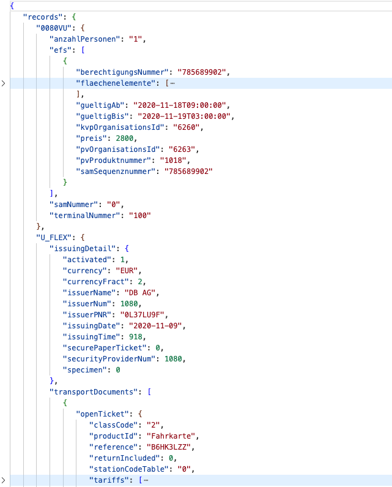
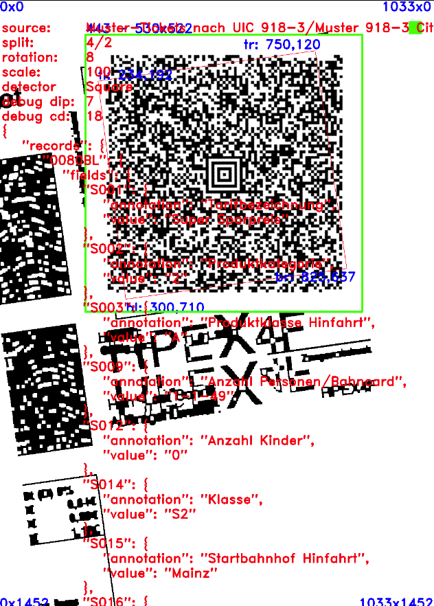

<!--
SPDX-FileCopyrightText: (C) 2022 user4223 and (other) contributors to ticket-decoder <https://github.com/user4223/ticket-decoder>
SPDX-License-Identifier: GPL-3.0-or-later
-->

[](https://github.com/user4223/ticket-decoder/actions/workflows/arm64-macos.yml)
[](https://github.com/user4223/ticket-decoder/actions/workflows/x64-macos.yml)
[](https://github.com/user4223/ticket-decoder/actions/workflows/ubuntu24-clang16.yml)
[](https://github.com/user4223/ticket-decoder/actions/workflows/ubuntu24-gcc13.yml)
[](https://github.com/user4223/ticket-decoder/actions/workflows/pypi.yml)

<!--
[](https://github.com/user4223/ticket-decoder/actions/workflows/ubuntu22-gcc11.yml)
-->
# Overview

Provide optimized and robust methods to detect and decode aztec-codes by using opencv and zxing-cpp in combination and to transcode UIC918 information with **signature validation** into json structure. (UIC918-3 and UIC918-9)<br>

**Looking for build instructions?** [Take a look at the end of this document!](#build-instructions)

## ticket-decoder

A command line tool to detect and decode uic918 content from aztec-codes from given input images/pdfs or raw data, verifies content and prints json result on stdout or dumps it into file.

Check `ticket-decoder --help` for arguments.

Example:  
`build/Release/bin/ticket-decoder -i ~/my-ticket.pdf`


<p>

## ticket_decoder (Python module)

For more details see here: [README](./source/python/README.md)

Prefer using the official module, but when you want to build the module locally,
the following steps should work:
```
uv build
uv pip install dist/ticket_decoder*.whl
uv run python
...
```

When the module has been built und installed successfully, it should be possible
to execute the following minimal Python script:
```
from ticket_decoder import DecoderFacade

decoder_facade = DecoderFacade(fail_on_interpreter_error = False)
for result in decoder_facade.decode_files('path/2/your/ticket.pdf'):
   print(result[1])
```

## ticket-analyzer

Analyzer has a minimal UI and is able to scan for aztec-codes in images grabbed from camera or from images/pdfs in a folder. It provides a simple interactive mode to visualize detection, image processing and decoding steps and to change some parameters to find optimal setup for detection. This application is considered to optimize default parameters and algorithms for the decoder (detector implementations).

Check `ticket-analyzer --help` for arguments.


<p>

To get a minimal setup for experimentation, do the following:
* Download UIC918-3 and UIC918-9 sample tickets from https://www.bahn.de/angebot/regio/barcode and extract zip files into folder ./images/
* Download XML file containing public keys of issuers from https://railpublickey.uic.org/ into folder ./cert/ and name it UIC_PublicKeys.xml
* Run `./build/Release/bin/ticket-analyzer` from workspace folder or use arguments to specify different paths to input files and folders
* Use following keys to tweak settings:
  * f: Next image input file from image-folder
  * F: Previous image input file from image-folder
  *  : Toggle and unpause camera device (space)
  * r: Rotate image -1 degree
  * R: Rotate image +1 degree
  * 2: Split image into 2 parts and rotate over parts
  * 4: Split image into 4 parts and rotate over parts
  * s: Scale image up
  * S: Scale image down
  * f: Flip image (x, y, x+y)
  * 0: Reset: Rotation, Scale, Split, Flip
  * d: Rotate over available detector implementations (forward, naive dip square detector, classifier)
  * p: Assume pure barcode (just forwarded to zxing-cpp)
  * b: Use local average binarizer (just forwarded to zxing-cpp)
  * h: Try harder (just forwarded to zxing-cpp)
  * D: Dump results into output-folder (0 disabled, 1 json, 2 json and raw data and images)
  * g: Increase gaussian kernal for smoothing (depends on detector)
  * i: Visualize next image processing step
  * I: Visualize previous image processing step
  * c: Visualize next contour detection step
  * C: Visualize previous contour detection step
  * o: Overlay detected barcode image (depends on detector)
  * t: Overlay decoded content or text (depends on detector)
* Check output-folder (./out by default) for intermediate images, raw data files or decoded data in json files


# Concepts and Ideas

## Design Goals

* Well separated dependencies to keep it maintainable and flexible for upcoming and deprecated libraries
  * The opencv core is an exception here since cv::Mat and other basic classes are used at all places
* Simple environment to evaluate changes in dip chain or decoder implementations from image files, binary data as well as from camera

## Modules

* **Input / Output:**\
Load and store for image and raw data from and to files and directories as well as read from camera device using opencv imageproc and highgui (includes PDF decoding via poppler library)
* **Detection:**\
Specialized [object detectors](source/lib/detector/api/include/Detector.h) for barcode shapes, see section below for details
* **Decoding:**\
[Decoders](source/lib/decoder/api/include/Decoder.h) to get raw byte-arrays from aztec-codes (an implementation using zxing-cpp is the only one right now, but this works really good)
* **Interpretation:**\
[Interpreters](source/lib/interpreter/api/include/Interpreter.h) to transcode different formats and records to json as well as verfication when possible (using interpreter pattern to separate the number of various, hierarchical structured data formats)
* **UI:**\
Optional and minimal user interaction methods to support fast interactive experimentation with parameters for detection and decoding using opencv highgui (used by ticket-analyzer only)

## Detector implementations

* **NOP Detector:**\
[NopDetector](source/lib/detector/api/include/NopDetector.h) simply passes the entire image from pre-processor to barcode decoder without additional modification (default decoder and working quite good in most settings)
* **(Naive) DIP Square Detector:**\
[SquareDetector](source/lib/detector/detail/square/include/SquareDetector.h) tries to detect squares by using digital image processing like smoothing, binarizing, mophological operations, convex hull, edge detection and stuff, and then it forwards only unwarped square image parts to barcode decoder (it does not perform as good as the built-in detection in zxing-cpp)
* **Classifier Detector:**\
[ClassifierDetector](source/lib/detector/detail/classifier/include/ClassifierDetector.h) is prepared to use the opencv classifier to detect barcode objects, but there is no properly trained classifier input file right now (frontal face detection example from opencv is used as an example and for verification only)


# Record Documentation

## U_HEAD / U_TLAY / U_FLEX

* Recommendation on TAP TSI Revision - Technical Document - B12<br>
  https://www.era.europa.eu/system/files/2022-10/Recommendation%20on%20TAP%20TSI%20Revision%20-%20Technical%20Document%20-%20B12.pdf <br>
  (Link not working anymore? Go to https://www.era.europa.eu/ and search for "TAP TSI Revision - Technical Document - B12")<br>
  (TAP: Telematics Applications for Passenger Service)<br>
  (TSI: Technical Specifications for Interoperability)<br>
  
### Code generation for U_FLEX ASN.1 UPER

This step is required only when the UIC specificatation gets updated and the change is relevant for the information used from the barcode details. This should not happen that often.

* UIC-barcode
  https://github.com/UnionInternationalCheminsdeFer/UIC-barcode (Apache License 2.0)
* Install free open source ANS.1 compiler (BSD 2)<br>
  https://github.com/vlm/asn1c<br>
  * MacOS: `brew install asn1c`
  * Ubuntu: `apt install -y asn1c`
* Generate required code by using the following support script:
```
# Clones the repository and calls asn1c with matching parameters at the right places
#
./etc/generate-uic-asn1-pods.sh
```

## 0080VU

* Interoperabilität Barcode DB Online-Ticket  
  https://assets.static-bahn.de/dam/jcr:8fa0c0b5-d7b8-443b-b3cd-7ae902884847/236539-315207.pdf

## 0080BL

* Parser für Onlinetickets der Deutschen Bahn  
  https://github.com/rumpeltux/onlineticket (GPL 3.0)
* uic-918-3  
  https://github.com/justusjonas74/uic-918-3 (MIT)

## SBB

* Parts of protobuf message  
  https://community.kde.org/KDE_PIM/KItinerary/SBB_Barcode (Creative Commons License SA 4.0)

## OEBB - 118199
* Simple JSON string  
  https://community.kde.org/KDE_PIM/KItinerary/Barcode_Formats (Creative Commons License SA 4.0)

## VDV

* There is no full public documentation, but some pieces of a puzzle:  
  https://magicalcodewit.ch/38c3-slides/#/32  
  https://github.com/TheEnbyperor/zuegli/tree/root/main/vdv (European Union Public License v1.2)  
  https://www.kcd-nrw.de/fileadmin/03_KC_Seiten/KCD/Downloads/Technische_Dokumente/Archiv/2010_02_12_kompendiumvrrfa2dvdv_1_4.pdf  
  https://www.kcd-nrw.de/fileadmin/user_upload/Abbildung_und_Kontrolle_in_NRW_1_5_5.pdf  
  https://mtv-unternehmen.de/fileadmin/user_upload/E_Anlage_24_EFM_Anh_8_StatBer_RMV-EFS_v1.9_210804_MVU_211020.pdf


# Signature Checking / Message Decryption / Id-Mapping

* Place XML file containing public keys from UIC at default location  
  `cert/UIC_PublicKeys.xml`
  * https://railpublickey.uic.org/

* Place LDIF export file containing public certificates from VDV at default location  
  `cert/VDV_Certificates.ldif`
  * Install 'Apache Directory Studio' or another useful tool to export LDIF:
    - on macos via `brew install apache-directory-studio`  
    - on linux see: https://directory.apache.org/studio/download/download-linux.html
  * Create a new connection to `ldaps://ldap-vdv-ion.telesec.de:636`
  * Navigate to `c=de,o=VDV Kernapplikations GmbH,ou=VDV KA`
  * Right click to `ou=VDV KA` and select 'Export' and 'LDIF Export'
  * Click continue, select a file name and continue until the export starts

* List of numeric codes for railway companies (RICS Code)  
  https://uic.org/support-activities/it/rics

* DB Railway Station Documentation (EVA/IBNR-Nummern)  
  https://data.deutschebahn.com/dataset/data-haltestellen.html


# Further Documentation and Ticket Samples

* Interoperability UIC/VDV codes, UIC918-3 and UIC918-9 example tickets and mappings for ids used in VDV codes  
  https://www.bahn.de/angebot/regio/barcode
  * [UIC918-3 Muster](https://assets.static-bahn.de/dam/jcr:c362849f-210d-4dbe-bb18-34141b5ba274/mdb_320951_muster-tickets_nach_uic_918-3_2.zip)
  * [UIC918-9 Muster](https://assets.static-bahn.de/dam/jcr:ec74454d-557b-438f-8ed9-689abcc276f5/Muster%20918-9.zip)
  
  You can use the following command to convert PDF file into images for further processing if you want, but you don't have to because the application is able to precess pdf files directly. But decoding quality might differ depending on parameters like DPI, so when you want to play with that...
  ```
  # brew|apt install imagemagick
  convert -density 250 -trim -quality 100 -flatten <file name>.pdf <file name>.png
  ```

* DB-AGs OLT Barcode to VDV Data Structure Reference Implementation  
  https://sourceforge.net/projects/dbuic2vdvbc/

* HandyTicket-Fahrausweise des VRR im VDV-Barcode  
  https://www.kcd-nrw.de/fileadmin/03_KC_Seiten/KCD/Downloads/Technische_Dokumente/Archiv/2010_02_12_kompendiumvrrfa2dvdv_1_4.pdf

* Additive Datenübertragung in Barcodes von internationalen Bahntickets  
  https://monami.hs-mittweida.de/frontdoor/deliver/index/docId/4983/file/WaitzRoman_Diplomarbeit.pdf

* KDE Barcode Formats - Ticket Barcode Formats  
  https://community.kde.org/KDE_PIM/KItinerary/Barcode_Formats
  Some details and collection of links related to different european rail companies and their ticket formats.

## Considerations about optical Resolution

* Printed code size: 48mm (1.89inch)
* With 200dpi:       1.89 inch/code * 200 dot/inch ~ 380 dot/code
* With UIC-918-3:    380  dot       / 87 blocks    ~ 4.37 dot/block


# Build Instructions

## Requirements

* **gcc >= 12 or clang >= 16 or apple-clang >= 17**  
  other compilers and versions may work but are not tested
* **python >= 3.13**
  older versions might work but are untested
* **conan 2 package manager**  
  see https://conan.io/ for details
* **cmake >= 3.22**
* **python3 numpy**  
  [boost.python requires numpy for build and unfortunately, it is not possible to disable it via conan config](https://github.com/conan-io/conan-center-index/issues/10953)

It is possible to enable/disable parts of the application or the Python module **to avoid the massive dependencies coming in with some features** (e.g. the user interface for ticket-analyzer). The following conan options (feature flags) are available:
* **with_ticket_analyzer=False**  
  skips creation of ticket-analyzer application entirely and avoids lots of system dependencies on Linux based systems and creates a smaller version of opencv without highgui module
* **with_ticket_decoder=False**  
  skips creation of ticket-decoder application and avoids library dependency to tclap in combination with **with_ticket_analyzer=False**
* **with_python_module=False**  
  skips creation of ticket_decoder Python module and avoids library dependency to boost for Python bindings
* **with_square_detector=False**  
  skips creation of experimental square detector, most users should disable this because it's not useful
* **with_classifier_detector=False**  
  skips creation of experimental classifier detector, most users should disable this as well because it's not useful
* **with_barcode_decoder=False**  
  skips creation of aztec-code/qr-code decoder and avoids dependency to zxing-cpp, this can be useful when you use the barcode decoder on Python side already (no need to have 2 barcode decoders) or you are working with barcode raw data from other source
* **with_pdf_input=False**  
  skips creation of PDF input module and avoids dependency to libpoppler and might be useful when you don't have PDF as a input format
* **with_signature_verifier=False**  
  skips creation of verification module and avoids dependency to botan and pugixml when you're not interested in signature verification of the ticket data
* **with_uic_interpreter=False**  
  skips creation of UIC interpreter module and avoids library dependency to zlib (**think twice** if you really want to disable this, **it makes this almost useless**)
* **with_vdv_interpreter=False**  
  skips creation of partially implemented VDV interpreter module
* **with_sbb_interpreter=False**  
  skips creation of SBB interpreter module and avoids dependency to protobuf

To enable/disable, please use prepared scripts like [setup.Decoder.sh](setup.Decoder.sh) and change desired feature toggles there. Or pass options like `-o:a="&:with_ticket_analyzer=False"` to conan install script. Check the script mentioned above as a guideline.

Following libraries are used by the project. Usually you should not care about it **since conan package manager will do that** for you.

* **opencv**  
  image processing, image i/o and optional object detection and minimal UI
* **zxing-cpp**  
  optional aztec-code/qr-code decoding
* **nlohmann_json**  
  json composition for output
* **easyloggingpp**  
  logging
* **pugixml**  
  optional xml support for parsing of UIC public key file
* **botan**  
  optional signature verification of barcode content
* **tclap**  
  cli argument processing
* **gtest**  
  unit testing
* **poppler** (see comment below)  
  optional pdf file reading/rendering
* **boost.headers**  
  base64 encoding/decoding
* **boost.python**  
  optional python bindings
* **protobuf**  
  optional SBB record interpretation

Workaround for poppler: since the official version of this library on conancenter is quite old, poppler is built locally 
via conan but with own recipe to get minimal and up-to-date version: see `etc/poppler/conanfile.py`.
Library creation is integrated in `etc/conan-install.sh` script which is called from common setup scripts automatically.

## Ubuntu 22/24

### Inside docker build container

In general, when you want to avoid to install additional dependencies like non-default compilers and libraries on your system, consider using one of the build scripts using a docker container to create the build environment.<br>
As long as the conanfile.py is unchanged, you can re-use the container with pre-built dependencies, source code changes are directly mirrored into build environment and artifacts are mirrored back into host system. In case dependencies change, the container gets re-build with updated dependencies.

**This will install dependencies and run the build inside a ubuntu docker build container**

* [etc/docker/setup.ubuntu22.gcc11.sh](etc/docker/setup.ubuntu22.gcc11.sh)
* [etc/docker/setup.ubuntu24.gcc13.sh](etc/docker/setup.ubuntu24.gcc13.sh)
* [etc/docker/setup.ubuntu24.clang16.sh](etc/docker/setup.ubuntu24.clang16.sh)
* [etc/docker/setup.ubuntu22.gcc11.Python.sh](etc/docker/setup.ubuntu22.gcc11.Python.sh)

When the preparation of the build environment has been successful, it should be possible to build the project by using `./build.sh -j3` **inside the build container**.
(When your container environment has enough memory, you can try `./build.sh -j` as well. But often this leads to out-of-memory-errors due to lots of files getting compiled in parallel and the container environment is killing the compilers when they reach the memory limit.)

Take a look into `./build/` folder to discover artifacts. You should be able to execute the executables **on host machine as well** when it runs the same OS.

### On host machine

When opencv has to be built from source because of missing pre-built package for your arch/os/compiler/config mix, it might
be necessary to install some further xorg/system libraries to make highgui stuff building inside conan install process.
To get this handled automatically, use the conan config flags shown below in `~/conan2/profiles/default` or pass additional
argument `-pr:a="./etc/conan/profiles/package-manager-config"` to conan-install call in `setup.All.sh`.
```
[conf]
tools.system.package_manager:mode=install
tools.system.package_manager:sudo_askpass=True
```
**Otherwise**, please install required xorg dependencies manually. For details about specific required packages,
please check the error message carefully and/or check `etc/install-ubuntu-dependencies.sh` for a list of dev-package names.
```
apt-get install --no-install-recommends -y build-essential make cmake git wget python-is-python3 python3-pip python3-dev libgtk2.0-dev
./etc/install-ubuntu-dependencies.sh

git clone https://github.com/user4223/ticket-decoder.git && cd ticket-decoder

python3 -m venv venv
. venv/bin/activate
pip install -r requirements.txt

./setup.All.sh -- -j

cert/install-uic-keys.sh

build/Release/bin/ticket-decoder-test
etc/python-test.sh
```

## MacOS with Apple clang17 (amd64 & arm64)

It might be required for dependencies to get built properly during conan install to have a
`python` command (without 3) in path available. So when you face an error like `python: command not found`
it might be required to create a link via `sudo ln -s $(which python3) /usr/local/bin/python` since there
is no package python-is-python3 in homebrew available, as it is for ubuntu. Verify your $PATH environment
variable to ensure `python` interpreter is taken from `/usr/local/bin` for the shell you are using.
```
xcode-select --install
brew install cmake

git clone https://github.com/user4223/ticket-decoder.git && cd ticket-decoder

python -m venv venv
. venv/bin/activate
pip install -r requirements.txt

./setup.All.sh Release -- -j

cert/install-uic-keys.sh

build/Release/bin/ticket-decoder-test
etc/python-test.sh
```

## Windows

For sure, it should be possible to get it built by using visual compiler and toolchain as well. But I never tried and you might need to modify some build parameters/arguments and you have know (or to find out) how to setup toolchain, conan and cmake in Windows environment. Furthermore, the compiler might complain about things gcc and clang are not complaining about. Pull request welcome!
